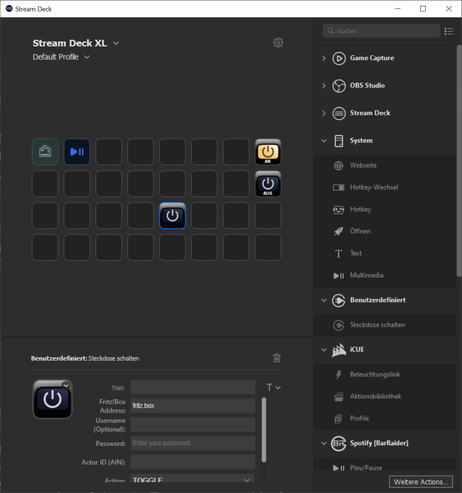

# Description

`Stream Deck Fritz` is a rudimentary plug-in for switch FRITZ!Box connected smart power sockets, such as the Fritz!Dect 200

This is a very basic implementation and does currently not support other FRITZ Smart Home appliances such as lights or thermostats, which I do not own. At this point the plug-in was developed to solve my personal integration problem.
However, the major technical issues are solved and the remaining work for a fully featured plug-in should be straight forward. Pull requests are more than welcome.

# Features
- code written in Javascript
- persistent settings (number of times the key was pressed)

# Installation

In the Release folder, you can find the file `net.heutelbeck.streamdeck.fritz.streamdeckPlugin`. If you double-click this file on your machine, Stream Deck will install the plugin.

# Source code

The Sources folder contains the source code of the plugin.
